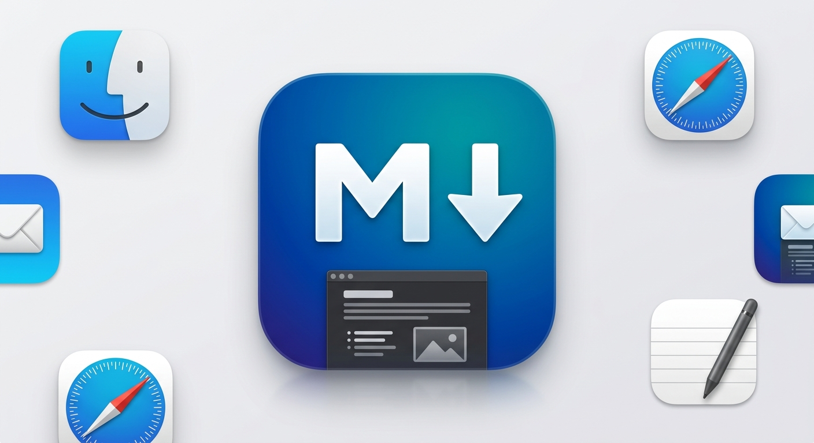
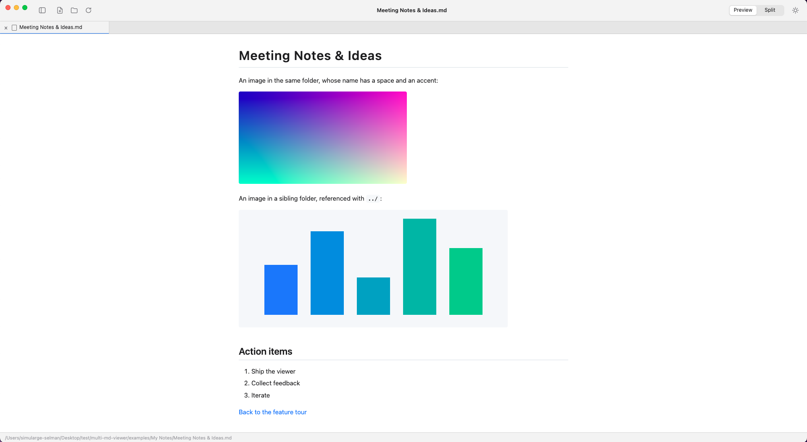
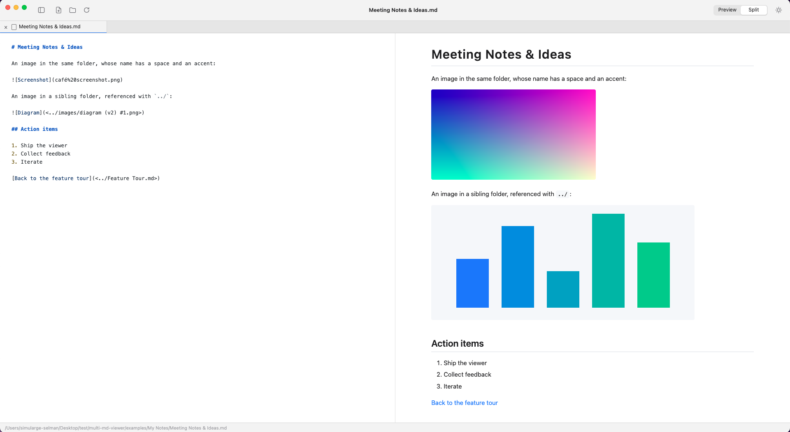
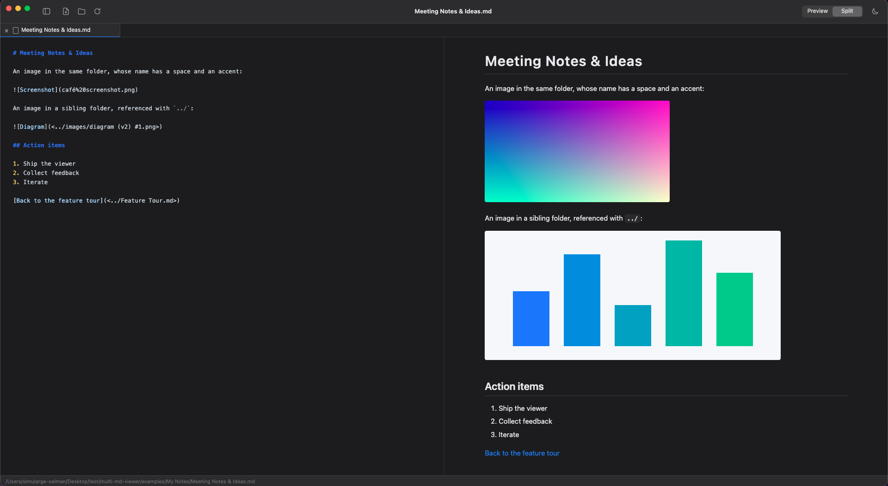

<p align="center">
  
</p>

# folio-md

A lightweight, native-feeling macOS desktop app for viewing Markdown files in tabs. Built with [Electron](https://www.electronjs.org), [markdown-it](https://github.com/markdown-it/markdown-it) and [highlight.js](https://highlightjs.org) using plain ES modules: no bundler, no UI framework.

## Screenshots



<table>
  <tr>
    <td width="50%"></td>
    <td width="50%"></td>
  </tr>
  <tr>
    <td align="center"><sub>Split view: light mode</sub></td>
    <td align="center"><sub>Split view: dark mode</sub></td>
  </tr>
</table>

## Features

- **Tabs**: open many Markdown files at once, switch without losing scroll position, close tabs individually, or open the same file in a second tab.
- **Proper Markdown rendering**: headings, emphasis, strikethrough, ordered and unordered lists, tables (with column alignment), blockquotes, inline code, fenced code blocks with syntax highlighting, links, horizontal rules and images.
- **Local images**: paths such as `` or `` resolve relative to the Markdown file, including paths with spaces, `#`, parentheses and non-ASCII characters. Missing images show a clear placeholder instead of breaking the page.
- **Image zoom**: click any image in a document to open it in a zoomable overlay. PNG files opened directly get a zoomable image tab. Supports pinch, ⌘-scroll, double-click, drag-to-pan and ⌘+ / ⌘− / ⌘0.
- **Drag & drop**: drop `.md`, `.markdown` or `.png` files onto the window to open them, or drop a folder to browse it in the sidebar.
- **Folder sidebar**: open a folder to list all Markdown files inside it, grouped by subfolder.
- **Split view**: show the highlighted Markdown source next to the rendered preview.
- **Live file watching**: when an open file changes on disk, a banner offers to reload it. Moved or deleted files are detected too.
- **Light, dark or system appearance**: choose from the toolbar or View › Appearance. The choice is remembered.
- **macOS integration**: native menus, file dialogs and window controls, hidden-inset title bar, sidebar vibrancy, File › Open Recent, and "Reveal in Finder".

## Requirements

- macOS
- [Node.js](https://nodejs.org) 20 (tested with 20.18.1) and npm

> Electron is pinned to `41.7.1` because the installers of newer Electron releases require Node.js ≥ 22.12. If you use Node.js 22.12 or newer, you can upgrade with `npm install -D electron@latest`.

## Getting started

```bash
git clone git@github.com:selmanbaskaya/folio-md.git
cd folio-md
npm install
npm start
```

You can also pass files or folders on the command line:

```bash
npm start -- "examples/Feature Tour.md" examples/logo.png
```

The [`examples/`](examples) folder contains sample documents and images covering every supported feature, including tricky file names.

## Usage

| Action | How |
| --- | --- |
| Open files | Toolbar button, **File › Open…**, or drag & drop |
| Open a folder | Toolbar button, **File › Open Folder…**, or drop a folder |
| Open a file in a new tab | Right-click a tab › **Open in New Tab**, or ⌘-click a link or sidebar item |
| Follow a link to another `.md` file | Click it. The file opens in a tab, or its tab is focused if already open |
| Zoom an image | Click it, then pinch, ⌘-scroll or use the zoom controls |
| Reveal the current file in Finder | Click the path in the status bar, or right-click a tab |

Opening a file that is already open focuses its existing tab instead of loading it again.

## Keyboard shortcuts

| Shortcut | Action |
| --- | --- |
| ⌘O | Open file |
| ⇧⌘O | Open folder |
| ⌘R | Reload the current file |
| ⇧⌘T | Open the current file in a new tab |
| ⌘W | Close tab (closes the window when no tabs are open) |
| ⇧⌘W | Close window |
| ⌘N | New window |
| ⇧⌘] / ⌃Tab | Next tab |
| ⇧⌘[ / ⌃⇧Tab | Previous tab |
| ⌘1 … ⌘8 | Select tab 1–8 |
| ⌘9 | Select the last tab |
| ⌃⌘S | Toggle sidebar |
| ⌥⌘U | Toggle source / preview split |
| ⌘+ / ⌘− / ⌘0 | Zoom the image when an image is shown, otherwise zoom the page |
| Esc | Close the image overlay |

## Project structure

```text
src/
├── main/                 # Electron main process (Node.js)
│   ├── main.js           # App lifecycle, command-line and Finder file opening
│   ├── window.js         # Window creation and message queueing
│   ├── menu.js           # Native application menu and shortcuts
│   ├── ipc.js            # IPC handlers: dialogs, file loading, context menus
│   ├── files.js          # Reading documents and scanning folders
│   ├── markdown.js       # markdown-it setup, image/link resolution, highlighting
│   ├── protocol.js       # md-asset:// protocol that serves local images
│   ├── watcher.js        # Watches open files for external changes
│   ├── theme.js          # Light / dark / system appearance
│   └── appIcon.js        # Dock icon from assets/md-logo.jpeg
├── preload/
│   └── preload.cjs       # Safe bridge between main process and UI
├── renderer/             # User interface
│   ├── index.html
│   ├── styles.css
│   ├── app.js            # Wiring: toolbar, commands, drag & drop, links
│   ├── tabs.js           # Tab manager
│   ├── sidebar.js        # Folder sidebar
│   ├── imageViewer.js    # Zoomable, pannable image viewer
│   └── dom.js
└── shared/
    └── fileTypes.js      # File type helpers used by both processes
```

## How it works

- **Rendering happens in the main process.** Markdown is parsed with markdown-it and code is highlighted with highlight.js, then only the resulting HTML is sent to the window.
- **Safe by default.** Raw HTML in Markdown is supported, like on GitHub, but passed through an allowlist sanitizer ([sanitize-html](https://github.com/apostrophecms/sanitize-html)) that removes scripts, event handlers, iframes, inline styles and `javascript:` links. The window runs with context isolation, a sandboxed preload and a strict Content Security Policy.
- **Local images** are resolved relative to each document and served through a custom `md-asset://` protocol. The protocol only serves image files.
- **Tabs share documents.** Each tab keeps its own view and scroll position, while tabs showing the same file share a single loaded copy and a single file watcher.

## Known limitations

- The app runs in development mode via `npm start`. It is not yet packaged as a `.app`, so Finder, the menu bar name and the app icon before launch still show Electron's defaults, and "Open With" from Finder is unavailable.
- Only PNG files can be opened as image tabs. Other image formats (JPEG, GIF, WebP, SVG…) still display inside Markdown documents.
